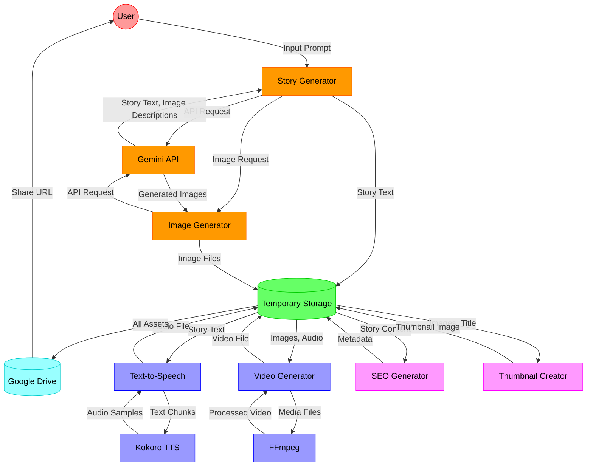
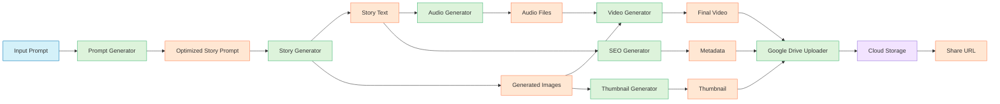

# 🧙‍♂️ Children's Story Generator

> 🪄 *An AI-powered application that automatically generates children's stories with images, converts them to audio, and combines everything into a complete video with visual effects. The final output is uploaded to Google Drive for distribution.*

## ✨ Features

- 📝 **AI Story Generation**: Creates unique children's stories using Google's Gemini AI models
- 🖼️ **Image Generation**: Generates images for each scene of the story
- 🔊 **Text-to-Speech**: Converts the story to high-quality audio narration
- 🎬 **Video Creation**: Combines images and audio into a video with professional transitions and effects
- 🔍 **SEO Metadata**: Generates YouTube-friendly titles, descriptions, and tags
- 🏞️ **Thumbnail Creation**: Creates an attractive thumbnail for the video
- ☁️ **Google Drive Integration**: Automatically uploads all content to Google Drive

## 📁 Project Structure

```
project/
├── main.py                 # Entry point that orchestrates the entire process
├── config/
│   ├── __init__.py
│   └── settings.py         # API keys and safety settings
├── utils/
│   ├── __init__.py
│   ├── drive_utils.py      # Google Drive functionality
│   ├── api_utils.py        # API retry mechanisms
│   └── media_utils.py      # Story text processing utilities
├── generators/
│   ├── __init__.py
│   ├── prompt_generator.py # Prompt generation
│   ├── story_generator.py  # Story generation with images
│   ├── audio_generator.py  # Text-to-speech conversion
│   └── video_generator.py  # Video creation with effects
└── metadata/
    ├── __init__.py
    └── seo_generator.py    # SEO metadata and thumbnail generation
```

## 📋 Requirements

- Python 3.7 or higher
- FFmpeg (for video creation)
- Google Gemini API key
- Google Drive API credentials (for uploading)

## 🔧 Installation

1. Clone this repository:
```
git clone <repository-url>
cd <repository-folder>
```

2. Install required dependencies:
```
pip install -r requirements.txt
```

3. Install FFmpeg (required for video generation):
   - **Windows**: Download from [ffmpeg.org](https://ffmpeg.org/download.html) and add to PATH
   - **MacOS**: `brew install ffmpeg`
   - **Linux**: `apt-get install ffmpeg`

4. Set up Gemini API access:
   - Get an API key from [Google AI Studio](https://makersuite.google.com/)
   - The application will randomly select from available API keys or you can set your own

5. (Optional) Set up Google Drive API:
   - Follow the [Google Drive API Python quickstart](https://developers.google.com/drive/api/quickstart/python)
   - Download credentials JSON file (service account key)
   - The application includes a test function to verify Drive API functionality

## 🚀 Usage

Run the main script:

```
python main.py
```

The application will:
1. Generate a creative prompt for a children's story
2. Use that prompt to generate a story with accompanying images
3. Clean and structure the story text
4. Convert story to speech audio
5. Process and resize images
6. Apply visual effects and create a video
7. Generate SEO metadata and a thumbnail
8. Upload everything to Google Drive
9. Provide direct download options if needed

## ⚙️ Configuration

- Modify the API keys in `config/settings.py` if needed
- Adjust safety settings to control content generation
- Change prompt templates in `generators/prompt_generator.py` to customize story themes

## 🛠️ Troubleshooting

- **No images generated**: The model may sometimes generate text descriptions instead of images. The application will automatically retry.
- **Google Drive upload fails**: Check your credentials and internet connection. A local download option is provided as fallback.
- **FFmpeg errors**: Ensure FFmpeg is correctly installed and accessible in your PATH.

## 📄 License

[MIT License](LICENSE)

## 🧪 Run on Google Colab

Copy and paste the following code into a Google Colab notebook cell to set up and run this project:

```python
# Clone the repository
!git clone https://github.com/abhiraman9012/Children-s-Story-Generator.git
%cd Children-s-Story-Generator

# Install required dependencies
!pip install -r requirements.txt

# Install FFmpeg (required for video generation)
!apt-get update
!apt-get install -y ffmpeg


# Run the application
!python main.py
```

## 💪 GitHub Actions Automation

This project is configured to run continuously using GitHub Actions to generate multiple stories without manual intervention.

### Setting Up GitHub Actions

1. **Configure Repository Secrets**
   - Go to your GitHub repository → Settings → Secrets and variables → Actions
   - Add a new repository secret named `GEMINI_API_KEY` with your Google Gemini API key

2. **Automated Daily Runs**
   - Three separate workflows run every day, each for exactly 3 hours:
     - **Workflow 1**: Runs at 3:00 AM - 6:00 AM UTC
     - **Workflow 2**: Runs at 9:00 AM - 12:00 PM UTC
     - **Workflow 3**: Runs at 3:00 PM - 6:00 PM UTC
   - This provides 9 hours of daily automated video generation
   - Each workflow produces approximately 18 videos (at 10 minutes per video)
   - No manual intervention required

3. **Manual Trigger (Optional)**
   - Go to the Actions tab in your repository
   - Select any of the four "Story Generator" workflows
   - Click "Run workflow"
   - Configure parameters:
     - **Duration**: Number of hours to run (default: 3.0 hours)
     - **Stories Count**: Number of stories to generate (default: unlimited)

4. **Access Generated Content**
   - After each workflow completes, go to the workflow run
   - Download the generated content artifact
   - The archive contains all stories, videos, thumbnails, and metadata files
   - Artifacts are automatically deleted after 2 days to save storage space

### How It Works

The GitHub Actions workflows:
1. **Automatic Scheduling**: Distributed throughout the day at 6-hour intervals (3AM, 9AM, and 3PM UTC)
2. **Precise Duration Control**: Each workflow runs for exactly 3 hours
3. **Environment Setup**: Configures Python with all dependencies and FFmpeg
4. **Continuous Generation**: Executes the `continuous_runner.py` script which:
   - Generates stories in a loop
   - Enforces unlimited story generation for scheduled runs
   - Saves all content to organized directories
   - Tracks statistics for each generation
   - Continues until time limit is reached

### Customizing

You can modify any of the workflow files in `.github/workflows/` to:
- Adjust the schedule timing (currently set at 6-hour intervals)
- Change the run duration (currently 3 hours each)
- Use different runner types (e.g., for higher performance)
- Add additional environment variables
- Integrate with other services like AWS S3 for storage

## 🧠 Architecture & Code Flow

### Visual Architecture Diagram

<div align="center">
  
</div>

*High-resolution diagram of the Children's Story Generator Architecture*

### Detailed Static Architecture

<div align="center">
  
</div>

*Component-level view showing all data flows between system elements*

### Complete System Architecture



### Detailed Data Flow Diagram



### 🔄 Complete Process Breakdown

#### 1️⃣ Initialization Phase
| Step | Component | Function | Description |
|------|-----------|----------|-------------|
| 1 | `main.py` | `main()` | Entry point that orchestrates all components |
| 2 | `utils/drive_utils.py` | `test_google_drive_api()` | Tests Google Drive API connectivity and permissions |
| 3 | `config/settings.py` | Environment variables | Loads API keys and configuration settings |

#### 2️⃣ Content Generation Phase

##### Prompt Generation
```python
# In generators/prompt_generator.py
generated_prompt = generate_prompt(prompt_input)
```

The prompt generation uses the `gemini-2.0-flash-thinking-exp-01-21` model to create an optimized, detailed prompt from a simple input. This step is crucial because the quality of the prompt significantly impacts story coherence and image quality.

**Process Details:**
1. Initialize Gemini client with safety settings (no content filtering to allow creative stories)
2. Format the initial prompt with specific instructions about story structure and image requirements
3. Stream the response to capture the generated prompt in real-time
4. Apply retry mechanism in case of API errors (up to 5 retries with exponential backoff)

##### Story & Image Generation
```python
# In generators/story_generator.py
result = retry_story_generation(use_prompt_generator=True)
```

This step uses the `gemini-2.0-flash-exp-image-generation` model, which has multimodal capabilities to generate both text and images in a single API call.

**Process Details:**
1. Setup streaming response handling to process content chunks incrementally
2. For each story segment, the model generates descriptive text and a corresponding image
3. Extracted images are saved to a temporary directory with proper naming convention
4. The story text is cleaned and parsed to identify scene breaks and narrative structure
5. If the story has insufficient segments or images, the system automatically retries
6. The retry mechanism implements a 7-second delay between attempts to avoid API rate limits

#### 3️⃣ Media Processing Phase

##### Audio Generation
```python
# In generators/audio_generator.py
audio_results = generate_audio(story_text, temp_dir)
```

The text-to-speech conversion uses the Kokoro TTS engine, which produces natural-sounding narration.

**Process Details:**
1. Initialize Kokoro pipeline with the 'af_heart' voice model
2. Process the story text in chunks to handle memory constraints
3. Generate audio samples for each text segment (24kHz sample rate)
4. Concatenate all audio segments into a single continuous narration
5. Save the combined audio as a WAV file for video integration

##### Video Creation
```python
# In generators/video_generator.py
video_results = generate_video(story_text, image_files, audio_results, temp_dir)
```

This step leverages FFmpeg to combine static images with audio into a professional-looking video.

**Process Details:**
1. Resize all images to 1920x1080 (16:9 aspect ratio) for YouTube optimization
2. Calculate the appropriate duration for each frame based on audio length
3. Apply visual effects including:
   - Smooth crossfade transitions between images
   - Ken Burns effect (subtle pan and zoom) to add dynamism
   - Overlay text captions from the story
4. Compile the final MP4 video with H.264 encoding for wide compatibility

#### 4️⃣ Distribution Phase

##### SEO & Metadata Generation
```python
# In metadata/seo_generator.py
metadata = generate_seo_metadata(story_text, image_files, prompt_text)
```

**Process Details:**
1. Analyze story content to extract key themes and characters
2. Generate a YouTube-optimized title (under 70 characters)
3. Create an engaging description with story summary and keywords
4. Compile relevant tags for search engine visibility

##### Thumbnail Creation
```python
# In metadata/seo_generator.py
thumbnail_path = generate_thumbnail(image_files, story_text, metadata)
```

**Process Details:**
1. Select the most visually appealing image from the story
2. Add text overlay with the story title using a child-friendly font
3. Apply visual enhancements (contrast, saturation) for better click-through rate
4. Save as a high-quality JPG for upload

##### Google Drive Upload
```python
# In main.py
upload_to_google_drive(output_path, story_text, prompt_text, image_files, metadata, thumbnail_path)
```

**Process Details:**
1. Authenticate with Google Drive using service account credentials
2. Create a folder with timestamped name for organization
3. Upload all assets (video, thumbnail, text transcript, metadata JSON)
4. Set appropriate sharing permissions (anyone with link can view)
5. Generate and display a shareable URL
6. Implement fallback direct download option in case of upload failure

### 🔁 Error Handling & Retry Mechanisms

The system implements robust error handling throughout:

1. **API Retries**: Exponential backoff for transient errors (network issues, rate limits)
2. **Content Validation**: Checks for story completeness and image quality
3. **Graceful Degradation**: If one component fails, the system attempts to continue with limited functionality
4. **Comprehensive Logging**: Detailed process tracking for troubleshooting

## 🙏 Acknowledgments

- Google Gemini models for AI content generation
- Kokoro for text-to-speech conversion
- FFmpeg for video processing
